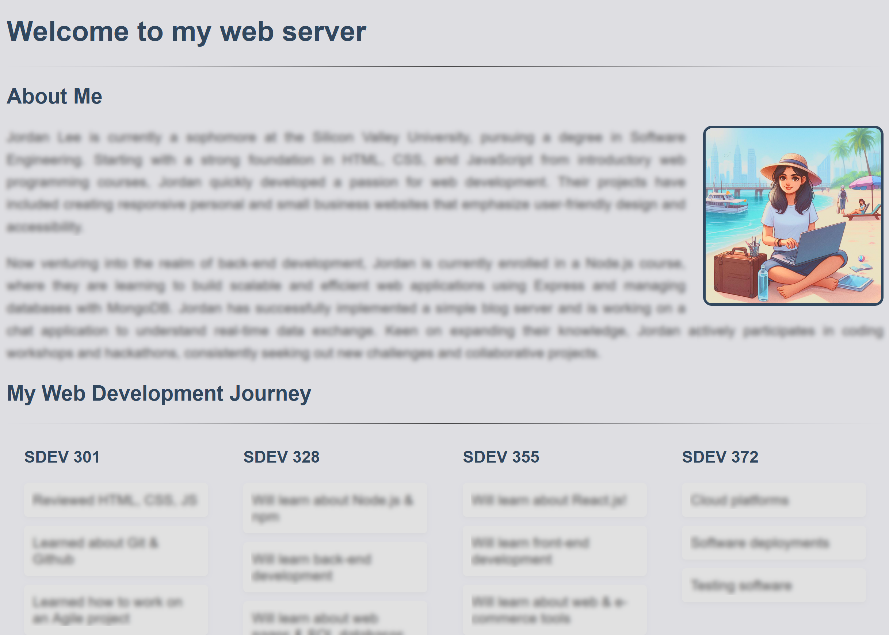

# Individual Assignment: Node.js Web Server

### Introduction
Understanding how web servers work is crucial for any software developer. This assignment will introduce you to the basics of building a web server using Node.js, focusing on serving static files and handling basic routing. You will not use Express.js for this project to reinforce your understanding of Node.js core modules.

### Objectives
1. Create a Node.js project from scratch.
2. Build a simple web server that can serve static files.
3. Understand and implement basic routing within your server.

## Project Setup

You should start by initializing a Node.js project with the following features:
   - using the ESM module syntax. For example:
   
     
   
   - update the `package.json` file to include
       - project-name
       - author information (name, email)
       - version control URL
   - Add an npm script to run your server using Nodemon. Using `npm run dev` should run your application.

Next, install the following required packages

   - `chalk`: For adding colors to your console outputs. This should be used to separate log statements for readability sake.

     

   - `nodemon`: For automatically restarting your server during development. `nodemon` should be used in your `npm run dev` script.

     

After your project is created, you should organize your project folder as follows:
   - `public/`: A directory for static files.
      - `public/home.html`: A basic HTML page.
      - `public/home.css`: A CSS stylesheet for styling your home.html page.
      - `public/me.png`: An image file showing yourself.   
   - `package.json`: This file contains your project configuration.
   - `server.js`: A startup script to launch your web server.

     

## Building the Web Server

The server.js file should create a new web server with the following configuration:

   - Use Node’s `http` module to create a server.
   - Start the server on `localhost:3000`.
   - Implement console logging to show each requested URL path when a request is made. Example: "Request for /home".

     

Each request to the server is handled using a request & response object. Together these should be used to give clients access to any file located in the `public/` directory:

   - The request will tell you which file is being targeted using the `request.url` property. The URL should then be appended to the `public/` directory to form a valid path to a file. For example:
     - /me.png → /public/me.png
     - /images/logo.png → /public/images/logo.png
     - /js/script.js → /public/js/script.js
   - The `fs` module can then be used to read the requested file and return the file contents in an HTTP response. 
      - If a file is found, the web server should return a status code of `200`.
      - If a file is **not** found, the web server should return a status code of `404`.

## Home Page Web Files

Your web server should include a homepage for users that want to learn about the project. This includes a home.html file and supporting files (CSS, JS, images, etc...).

The **home.html** file should include:
  - Your name.
  - Your picture (`me.png`).
  - A brief biography of your experience as a web developer.
  - A roadmap of your upcoming web development courses and the technologies you will learn.

The **home.css** file should include appropriate styles that gives your page a professional look. For example:

## Simple Page Routing

To make your homepage more accessible, you should add further logic to the web server that explicitly handles the following paths, all of which should load the `home.html` file:
  - `localhost:3000` (the base url of the server)
  - `localhost:3000/home` (a custom route)
  - `localhost:3000/index` (a custom route)

## Testing Your Web Server

It is best to test your web server by including folders and files in the public/ directory and verifying that HTML, CSS, JS, and other files are loading correctly. 

Download the following zip folder, which contains three test projects. Unzip the contents into your project and verify that the projects can be viewed with the following URLs:

- `localhost:3000/project1/clock.html` - a project that displays a clock

  

- `localhost:3000/project2/products.html` - a project that lists a group of products

   

- `localhost:3000/project3/index.html` - a personal web page with several links between the pages

   

Note: Your instructor will be using this same zip folder to test your web server. So it is imperative to do the same before submitting your work.

## Helpful Hints
- **Debugging:** It is highly recommended to use `nodemon` for active debugging during development; it refreshes your server automatically after changes. 
- **Trace Statements:** While debugging, it can be useful to regularly print values out the console on the back-end. You can even use the `chalk` package to color the output and make it more visible! 
- **File Paths:** Pay close attention to file paths when linking resources in HTML and CSS. All paths on the server should begin with a / forward-slash.

Good luck, and have fun learning the inner workings of web servers with Node.js!